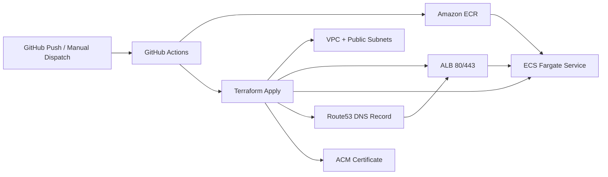

# Assignment 1 - Open Source App Hosted on ECS with Terraform

This repository deploys a containerized open-source app to AWS ECS Fargate using Terraform and GitHub Actions OIDC.

## Architecture



## Project Checklist Status

- App endpoint: `/health` returns `{"status":"ok"}`
- Docker: multi-stage build with `.dockerignore`
- Registry: image pushed to ECR via workflow
- Terraform: modularized infra for VPC, ALB, ECS, ECR, Route53
- CI/CD: single workflow `.github/workflows/deploy.yml` for deploy/destroy
- HTTPS and DNS: ACM + Route53 alias to ALB

## Repository Structure

```text
.
├── app/
│   ├── ecs-assignment-main/
│   │   ├── dockerfile
│   │   └── .dockerignore
│   └── Infra/
│       ├── main.tf
│       ├── variables.tf
│       ├── outputs.tf
│       └── modules/
└── .github/workflows/deploy.yml
```

## Local Development

### Run app locally

```bash
cd app/ecs-assignment-main
yarn install
yarn start
curl http://localhost:80/health
```

### Build and run container locally

```bash
cd app/ecs-assignment-main
docker build -t threatmod-local -f dockerfile .
docker run --rm -p 80:80 threatmod-local
curl http://localhost:80/health
```

## Terraform Usage

From `app/Infra`:

```bash
terraform init
terraform fmt -recursive
terraform validate
terraform plan \
  -var="domain_name=tm.example.com" \
  -var="hosted_zone_name=example.com" \
  -var="image_url=<aws_account_id>.dkr.ecr.eu-north-1.amazonaws.com/ecs-threatmod:latest"
terraform apply -auto-approve
```

Destroy:

```bash
terraform destroy -auto-approve \
  -var="domain_name=tm.example.com" \
  -var="hosted_zone_name=example.com" \
  -var="image_url=<aws_account_id>.dkr.ecr.eu-north-1.amazonaws.com/ecs-threatmod:latest"
```

## CI/CD Workflow

File: `.github/workflows/deploy.yml`

- On push to `main`:
  - Build and push Docker image to ECR
  - Run Terraform fmt/init/validate/plan/apply
  - Run post-deploy health check against `https://$DOMAIN_NAME/health`
- Manual dispatch:
  - `action=deploy` to deploy
  - `action=destroy` plus `confirm_destroy=DESTROY` to destroy

Required GitHub secrets:

- `AWS_ROLE_TO_ASSUME`
- `DOMAIN_NAME`
- `HOSTED_ZONE_NAME` — apex domain name of the Route53 hosted zone (for example `networking-lab.uk`), **not** the `tm.` subdomain
- `HOSTED_ZONE_ID` (optional) — if name lookup fails, set this to the zone ID (for example `Z0408373IFCSBCMQ1OZT`) and you can leave `HOSTED_ZONE_NAME` empty

## Screenshots to Include

Add screenshots in a `docs/` folder and link them here:

- Local app `/health` response
- Local Docker container running
- Successful GitHub Actions run
- AWS resources in ECS/ALB
- Working HTTPS endpoint

## Notes

- Terraform backend is local-state in this repository setup.
- OIDC is used for GitHub Actions AWS authentication (no long-lived AWS keys).
