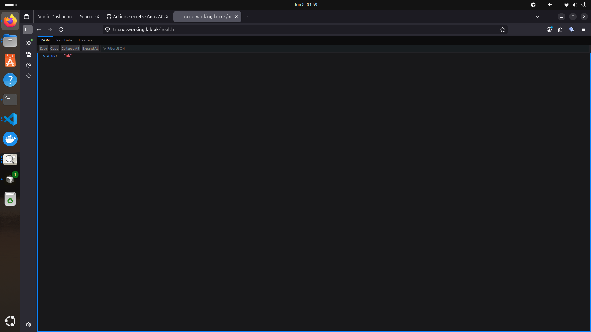

# School Equipment Borrowing System

Frontend only web app for school equipment borrowing requests. No backend, no database. Data is stored in browser `localStorage`. PHP only serves pages; logic runs in JavaScript.

**Live:** [https://tm.networking-lab.uk](https://tm.networking-lab.uk)

## What it does

Students and teachers submit borrowing requests. Admins approve, deny, or delete requests and set return dates. All data stays in the browser per device.

## Stack

**App:** HTML, CSS, vanilla JS, PHP (static serving), localStorage

**AWS:** ECS Fargate, ECR, ALB, Route 53, ACM (eu-north-1)

**CI/CD:** GitHub Actions + OIDC, Terraform, Docker

```
User → Route 53 → ALB (HTTPS) → ECS (Apache/PHP) → ECR
Browser → localStorage
```

## Run locally

```bash
git clone https://github.com/Anas-A079/ecs-main2.git
cd ECS-project-NewApp/school-equipment
docker build -t school-equipment .
docker run -p 8080:8080 school-equipment
```

App: http://localhost:8080  
Admin: http://localhost:8080/admin.php

## Deploy

Push to `main` triggers `.github/workflows/deploy.yml`:

1. OIDC auth to AWS
2. Build and push Docker image to ECR
3. Terraform plan and apply
4. ALB health check on `/health`

Manual: `cd Infra && terraform init && terraform apply`

Destroy: run `ecs-destroy.yml` workflow (type `DESTROY` to confirm) or `terraform destroy`

### GitHub secrets

| Secret | Purpose |
|---|---|
| `AWS_ROLE_TO_ASSUME` | IAM role ARN for OIDC |
| `DOMAIN_NAME` | App hostname (e.g. `tm.networking-lab.uk`) |
| `HOSTED_ZONE_NAME` | Route53 zone name |

Other values are in `Infra/terraform.tfvars`.

## Screenshots

**Borrowing form**


**Admin panel**


**ALB health check**



**Deploy workflow**


**Destroy workflow**


**Demo:** [screencast](school-equipment/assets/images/Screencast%20from%202026-06-08%2001-39-57.webm)

## Project layout

```
.github/workflows/     deploy.yml, ecs-destroy.yml
Infra/                 Terraform (vpc, ecr, alb, ecs, route53)
school-equipment/      PHP app, Dockerfile, assets/images/
```

## Notes

- GitHub Actions uses OIDC. No AWS access keys in the repo.
- HTTPS via ALB + ACM.
- localStorage is demo only. Not multi user or persistent across browsers.
