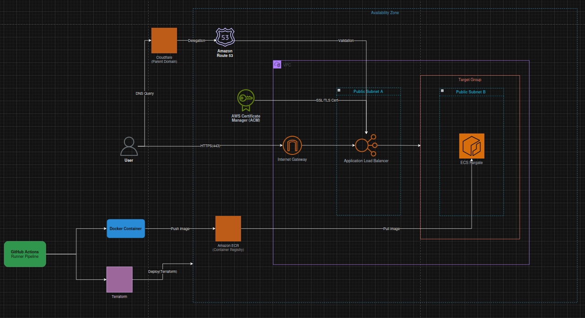
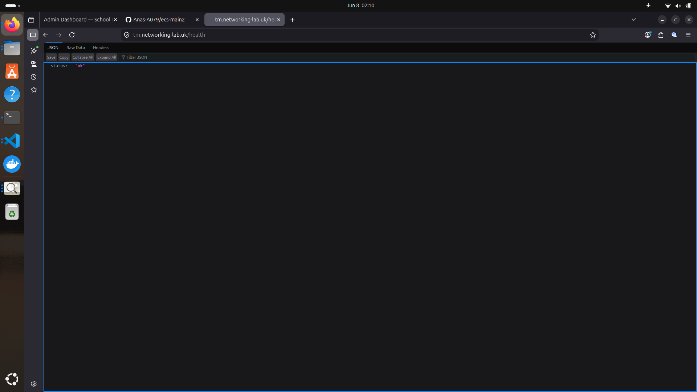

# 🏫 School Equipment Borrowing System

> A frontend-only web application for managing school equipment borrowing requests. Containerised with Docker, deployed on AWS ECS Fargate, and provisioned with Terraform and GitHub Actions.

**Live site:** [https://tm.networking-lab.uk](https://tm.networking-lab.uk)

---

## 📌 Overview

The **School Equipment Borrowing System** is a **frontend application with no backend**. Students and teachers submit borrowing requests through a web form; an admin dashboard lets authorised users approve, deny, or delete requests and set return dates.

All request data is stored in the browser using **`localStorage`**. There is no server-side database, no REST API, and no authentication layer. PHP is used only to **serve the HTML pages**; all application logic runs in **vanilla JavaScript** on the client.

The AWS infrastructure (ECS, ALB, Route 53, ACM, ECR) is there to **host and deliver** this static frontend over HTTPS. It does not provide any application backend services.

---

## 🏗️ Architecture


**Architecture Diagram** (`ArchitectureDiagram.png`)




### AWS Services Used

| Service | Role |
|---|---|
| **ECS Fargate** | Hosts the Apache + PHP container (serves frontend files) |
| **ECR** | Private Docker image registry |
| **ALB** | HTTPS load balancing and routing |
| **Route 53** | DNS management |
| **ACM** | SSL/TLS certificate provisioning |
| **IAM (OIDC)** | Keyless GitHub Actions authentication |

---

## ✨ Features

- 📋 **Borrowing Request Form**: students and teachers submit equipment requests
- 🛠️ **Admin Dashboard**: centralised view of all requests
- ✅ **Approve / Deny / Delete**: full request lifecycle management
- 📅 **Return Date Setting**: admins assign expected return dates on approval
- 🔍 **Search & Filter**: filter requests by status, name, or equipment
- 📊 **Summary Statistics**: live counts of pending, approved, and denied requests
- 📱 **Responsive UI**: mobile-friendly layout
- 💾 **localStorage Persistence**: all data stored client-side in the browser

---

## 🧰 Tech Stack

### Frontend (application)
- HTML5 / CSS3
- Vanilla JavaScript (ES6+)
- Browser `localStorage`
- PHP 8 *(page serving only, no backend logic)*

### Infrastructure (IaC)
- Terraform (modular)
- AWS ECS Fargate, ECR, ALB, Route 53, ACM

### CI/CD
- GitHub Actions
- AWS OIDC (no static credentials)
- Docker

---

## 📁 Folder Structure

```
ECS-project-NewApp/
├── .github/
│   └── workflows/
│       ├── deploy.yml          # Build, push, and deploy to ECS
│       └── ecs-destroy.yml     # Teardown workflow
│
├── Infra/
│   ├── main.tf                 # Root Terraform config
│   ├── provider.tf             # AWS provider
│   ├── variables.tf            # Input variables
│   ├── outputs.tf              # Stack outputs
│   ├── terraform.tfvars        # Environment-specific values
│   └── modules/
│       ├── vpc/                # VPC, subnets, routing
│       ├── ecr/                # ECR repository
│       ├── alb/                # Load balancer + HTTPS listener + ACM
│       ├── ecs/                # Fargate cluster, task def, service
│       └── route53/            # DNS records
│
├── school-equipment/
│   ├── Dockerfile              # Apache + PHP image (port 8080)
│   ├── health.php              # ALB health check endpoint
│   ├── index.php               # Student/teacher borrowing form
│   ├── admin.php               # Admin dashboard
│   └── assets/
│       ├── css/
│       │   └── style.css       # Global styles
│       ├── js/
│       │   ├── app.js          # Request submission logic
│       │   ├── admin.js        # Admin dashboard logic
│       │   └── storage.js      # localStorage abstraction layer
│       └── images/             # Screenshots and demo media
│           ├── SchoolBorrowRequest.png
│           ├── SchoolAdminPanel.png
│           ├── healthCheck.png
│           ├── EcsDeploy.png
│           ├── EcsDestroy.png
│           └── Screencast from 2026-06-08 01-39-57.webm
│
└── README.md
```

---

## 🖥️ Run Locally

### Prerequisites
- Docker installed and running

### Steps

```bash
# Clone the repository
git clone https://github.com/Anas-A079/ecs-main2.git
cd ECS-project-NewApp/school-equipment

# Build the Docker image
docker build -t school-equipment .

# Run the container (app listens on 8080 inside the container)
docker run -p 8080:8080 school-equipment
```

Open your browser at **http://localhost:8080**

> Admin panel: **http://localhost:8080/admin.php**

---

## 🚀 Deployment

### CI/CD Flow (GitHub Actions)

```
git push → GitHub Actions triggered
              │
              ├── 1. Authenticate to AWS via OIDC
              ├── 2. Build Docker image
              ├── 3. Push image to Amazon ECR
              ├── 4. Run Terraform plan + apply
              ├── 5. Update ECS Fargate service
              └── 6. ALB health check on /health
```

### Manual Infrastructure Deployment

```bash
cd Infra/

terraform init
terraform plan
terraform apply
```

### Destroy Infrastructure

```bash
terraform destroy
```

> Alternatively, trigger the `ecs-destroy.yml` workflow from GitHub Actions. Type `DESTROY` to confirm.

### GitHub Actions OIDC

Workflows authenticate to AWS using **OIDC** (OpenID Connect). No long-lived access keys are stored in GitHub. Each job requests a short-lived token, then assumes an IAM role in your AWS account.

```
GitHub Actions job
      │
      ▼
  OIDC token issued (id-token: write permission)
      │
      ▼
  sts:AssumeRoleWithWebIdentity
      │
      ▼
  IAM role (AWS_ROLE_TO_ASSUME)
      │
      ▼
  ECR push / Terraform apply or destroy
```

On the AWS side you need an IAM OIDC identity provider for `token.actions.githubusercontent.com` and a role trust policy scoped to this repo (`Anas-A079/ecs-main2`).

### Repository secrets

Configure these under **Settings → Secrets and variables → Actions → Secrets**:

| Secret | Used by | Description |
|---|---|---|
| `AWS_ROLE_TO_ASSUME` | deploy, destroy | Full ARN of the IAM role GitHub assumes via OIDC (e.g. `arn:aws:iam::123456789012:role/github-actions-ecs-main2`) |
| `DOMAIN_NAME` | deploy, destroy | Application URL hostname passed to Terraform (e.g. `tm.networking-lab.uk`) |
| `HOSTED_ZONE_NAME` | deploy, destroy | Route53 hosted zone name (e.g. `tm.networking-lab.uk`) |

`hosted_zone_id` and other infra settings live in `Infra/terraform.tfvars` in the repo. The deploy workflow also passes the built Docker image URL via `TF_VAR_image_url`.

---

## 📸 Screenshots & Demo

All media lives in `school-equipment/assets/images/`.

### Application UI

**Borrowing Request Form** (`SchoolBorrowRequest.png`)


**Admin Dashboard** (`SchoolAdminPanel.png`)


### ALB health check

**Healthy targets** (`HealthCheck.png`)



### CI/CD Workflows

**ECS Deploy workflow** (`EcsDeploy.png`)


**ECS Destroy workflow** (`EcsDestroy.png`)


### Demo walkthrough

A screen recording of the application in use is included:

🎬 [Screencast from 2026-06-08 01-39-57.webm](school-equipment/assets/images/Screencast%20from%202026-06-08%2001-39-57.webm)

---

## 🔒 Security Notes

- **No static AWS credentials**: GitHub Actions authenticates via AWS OIDC (IAM Identity Provider)
- **HTTPS enforced**: all traffic goes through the ALB with an ACM-managed TLS certificate
- **No backend attack surface**: no database, API, or server-side session handling
- **localStorage limitation**: data is stored client-side only. Clearing browser data erases all requests. Not suitable for real multi-user production use without a backend.

---

## 🔭 Future Improvements

- [ ] Add a real backend and database (e.g. Amazon RDS / DynamoDB + REST API)
- [ ] Add user authentication (e.g. Amazon Cognito)
- [ ] Role-based access control (student vs. teacher vs. admin)
- [ ] Email notifications on request approval/denial (Amazon SES)
- [ ] Audit log for admin actions
- [ ] Terraform remote state via S3 + DynamoDB locking
- [ ] Multi-environment support (dev / staging / prod)

---

## 👤 Author

Built as a DevOps portfolio project demonstrating AWS infrastructure, containerisation, and CI/CD. Hosts a lightweight frontend-only application on ECS Fargate.
