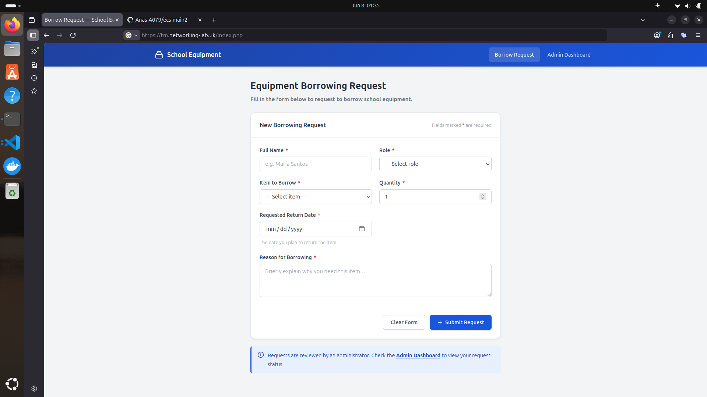
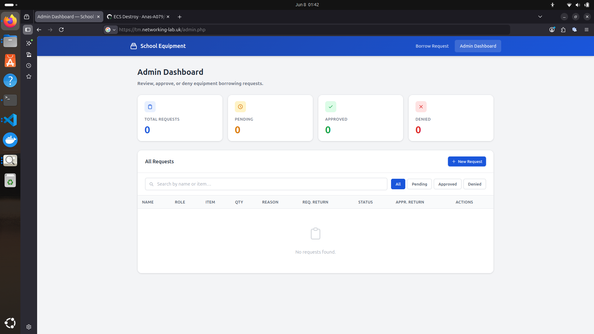

# School Equipment Borrowing System

A **frontend-only** web application that allows students and teachers to request school equipment. An administrator can review, approve, or deny requests and set official return dates.

There is **no backend**: no database, no API, and no server-side business logic. All data is stored in the browser using **`localStorage`**. PHP files exist only to serve the HTML pages. All behaviour is handled by **vanilla JavaScript** on the client.

---

## Features

- **Borrowing request form**: submit requests with name, role, item, quantity, reason, and requested return date
- **Admin dashboard**: view all requests in a sortable, searchable table
- **Summary cards**: live counts of Total, Pending, Approved, and Denied requests
- **Approve / Deny / Delete**: with confirmation dialogs and return date picker
- **Search & filter**: search by name or item; filter by status
- **Responsive design**: works on mobile and desktop
- **No login required**: open access for demonstration purposes

---

## Technology Stack

| Layer        | Technology                                      |
|---|---|
| Markup       | HTML5 (via PHP page shells)                     |
| Styling      | CSS3 (custom, no frameworks)                    |
| Behaviour    | Vanilla JavaScript (ES6+)                       |
| Persistence  | Browser `localStorage` (client-side only)       |
| Server       | PHP 8 / Apache (serves static pages, no API)    |

> This is **not** a full-stack application. PHP does not process form submissions or store data on the server.

---

## File Structure

```
school-equipment/
├── index.php              # Borrowing request form
├── admin.php              # Admin dashboard
├── health.php             # Health check endpoint (for ALB)
├── Dockerfile             # Container image (Apache on port 8080)
├── assets/
│   ├── css/
│   │   └── style.css      # All styles
│   ├── js/
│   │   ├── storage.js     # localStorage read/write helpers
│   │   ├── app.js         # Request form logic
│   │   └── admin.js       # Dashboard logic (table, modals, filters)
│   └── images/            # Screenshots and demo media
│       ├── SchoolBorrowRequest.png
│       ├── SchoolAdminPanel.png
│       ├── EcsDeploy.png
│       ├── EcsDestroy.png
│       └── Screencast from 2026-06-08 01-39-57.webm
└── README.md
```

---

## Screenshots

### Borrowing Request Form



### Admin Dashboard



### Demo walkthrough

🎬 [Application screencast](assets/images/Screencast%20from%202026-06-08%2001-39-57.webm)

---

## Requirements

- **PHP 7.4 or later** (PHP 8.x recommended), for local development only
- A web server that can serve PHP files (Apache, Nginx, or PHP's built-in server)

> No database, no Composer dependencies, and no build step.

---

## Setup & Running

### Option 1: Docker (matches production)

```bash
docker build -t school-equipment .
docker run -p 8080:8080 school-equipment
```

Open **http://localhost:8080**

### Option 2: PHP built-in server (quickest)

```bash
php -S localhost:8000
```

Open **http://localhost:8000**

### Option 3: Apache (XAMPP / WAMP / LAMP)

1. Copy the `school-equipment/` folder into your web root (e.g. `htdocs/` or `www/`).
2. Start Apache.
3. Open **http://localhost/school-equipment/**.

---

## Usage

### Submitting a Request (`index.php`)

1. Open the home page.
2. Fill in all required fields (name, role, item, quantity, reason, return date).
3. Click **Submit Request**. Data is saved to `localStorage` in your browser.

### Managing Requests (`admin.php`)

1. Open the Admin Dashboard.
2. View, search, and filter requests.
3. **Approve**: set the official return date and confirm.
4. **Deny** or **Delete**: update or remove requests.

---

## Data Model

Each request stored in `localStorage` has the following shape:

```json
{
  "id": "req_1716300000000_abc12",
  "name": "Maria Santos",
  "role": "Student",
  "item": "Laptop",
  "quantity": 1,
  "reason": "For my thesis presentation.",
  "requestedReturnDate": "2026-05-30",
  "approvedReturnDate": "2026-05-28",
  "status": "Approved",
  "createdAt": "2026-05-20T09:00:00.000Z"
}
```

All requests are stored as a JSON array under the key **`schoolBorrowingRequests`** in `localStorage`.

---

## Browser Compatibility

Works in all modern browsers (Chrome, Firefox, Edge, Safari). Requires JavaScript enabled and `localStorage` available.

---

## Notes

- Data is stored **per browser / per device**. Clearing browser data erases all requests.
- There is no authentication. The admin dashboard is open to anyone with the URL.
- To reset all data: Developer Tools → Application → Local Storage → delete `schoolBorrowingRequests`.
